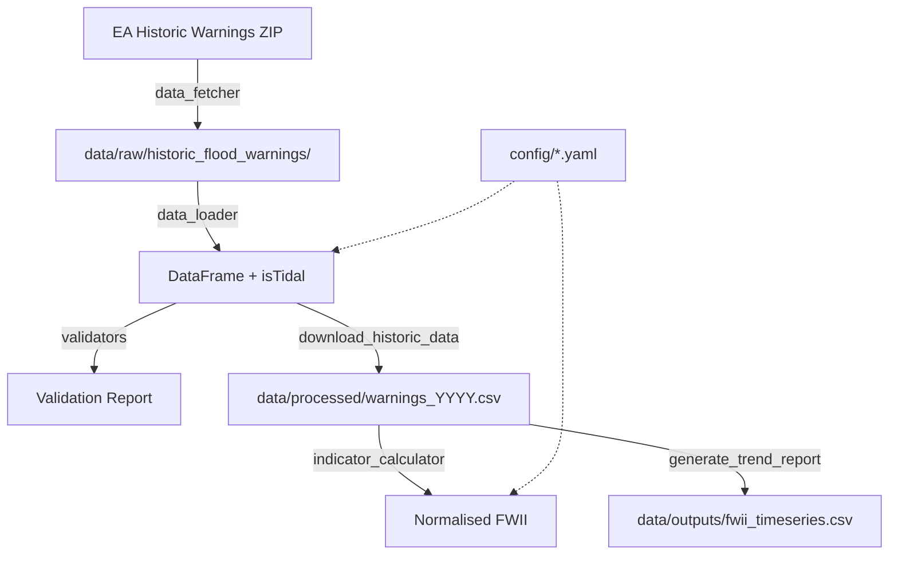

# FWII Architecture

## Overview

The Flood Warning Intensity Index (FWII) system downloads Environment Agency historic
flood warning data, filters it to 18 West of England warning areas, calculates
duration-weighted severity scores, and normalises against a 2020 baseline to produce
a composite index. It's a batch pipeline run annually via CLI scripts.

## Architecture Diagram

## Components

### Config Layer

**Purpose**: Load settings, warning area definitions, and baseline values from YAML.

**Location**: `src/fwii/config.py`, `config/settings.yaml`, `config/warning_areas.yaml`,
`config/baseline_2020.yaml`

**Key Symbols**: `Config` class with property accessors for all settings, including
`warning_areas`, `warning_area_codes`, `baseline`, and `save_baseline()`.

**Interactions**: Read by nearly every other module. All config access routes through
the `Config` class.

### Data Fetcher

**Purpose**: Download and extract the EA Historic Flood Warnings ZIP.

**Location**: `src/fwii/data_fetcher.py`

**Key Symbols**: `HistoricWarningsFetcher`, `DataFetchError`

**Interactions**: Called by `download_historic_data.py`. Outputs to `data/raw/`.

### Data Loader

**Purpose**: Parse CSV/ODS/JSON files, normalise EA column names to internal schema,
parse timestamps, filter to West of England areas, join `isTidal` from config.

**Location**: `src/fwii/data_loader.py`

**Key Symbols**: `HistoricWarningsLoader`, `DataLoadError`

**Interactions**: Called by `download_historic_data.py`. Gets warning area codes and
`isTidal` values from `Config`. The `isTidal` join happens once in
`_filter_west_of_england()`.

### Duration Calculator

**Purpose**: Estimate warning durations using heuristics (EA data lacks end times),
then score by severity weight. Fully vectorised using Polars expressions.

**Location**: `src/fwii/duration_calculator.py`

**Key Symbols**: `DurationCalculator`, `DurationConfig`

**Interactions**: Called by `IndicatorCalculator`. Operates on and returns Polars
DataFrames — no row-by-row iteration.

### Indicator Calculator

**Purpose**: Orchestrate duration calculation, annual aggregation, baseline
normalisation, and composite FWII.

**Location**: `src/fwii/indicator_calculator.py`

**Key Symbols**: `IndicatorCalculator`, `BaselineScores`, `NormalizedIndicators`

**Interactions**: Called by `calculate_fwii.py`, `generate_trend_report.py`, and
`run_pipeline.py`. Loads baseline from `Config`.

### Validators

**Purpose**: Check data quality (missing fields, duplicates, timestamp consistency,
completeness).

**Location**: `src/fwii/validators.py`

**Key Symbols**: `HistoricWarningsValidator`, `ValidationReport`, `ValidationIssue`

**Interactions**: Called by `download_historic_data.py`. Results saved as JSON.

### API Client

**Purpose**: Interact with the EA Flood Monitoring API for fetching warning area
definitions.

**Location**: `src/fwii/api_client.py`

**Key Symbols**: `FloodMonitoringClient`, `FloodMonitoringAPIError`

**Interactions**: Called by `fetch_warning_areas.py`. Handles pagination, rate
limiting, and retries.

### Scripts

| Script | Purpose | Reads From | Writes To |
|--------|---------|------------|-----------|
| `fetch_warning_areas.py` | Fetch area definitions from API | EA API | `config/warning_areas.yaml` |
| `download_historic_data.py` | Download, load, validate, export pipeline | EA ZIP | CSVs + JSON reports |
| `calculate_fwii.py` | Calculate FWII for one year | `data/processed/` CSV | stdout |
| `generate_trend_report.py` | Multi-year trend analysis | `data/processed/` CSV | `data/outputs/fwii_timeseries.csv` |
| `run_pipeline.py` | Unified pipeline (download + calculate + trend) | All of above | All of above |
| `test_duration_calculator.py` | Manual test/demo of duration calculator | `data/processed/` CSV | stdout |

## Data Flow

1. **Fetch**: `data_fetcher.py` downloads a ~3.5MB ZIP from EA, extracts ODS/CSV to
   `data/raw/historic_flood_warnings/`.
2. **Load & Filter**: `data_loader.py` reads the raw files, maps EA column names
   (`DATE`/`CODE`/`TYPE`) to internal names (`timeRaised`/`fwdCode`/`severity`),
   maps severity text to levels using exact string matching, parses timestamps,
   filters to 18 configured fwdCodes, and joins `isTidal` from config.
3. **Export**: `download_historic_data.py` writes per-year CSVs (with `isTidal`)
   to `data/processed/`.
4. **Calculate**: `calculate_fwii.py` loads a year's CSV, runs vectorised
   `DurationCalculator`, aggregates scores, normalises against 2020 baseline.
5. **Report**: `generate_trend_report.py` repeats step 4 for all years >= 2020,
   produces a summary table and trend CSV.

## Configuration

| File | Purpose |
|------|---------|
| `config/settings.yaml` | API URLs, rate limits, severity weights, composite weights, baseline year |
| `config/warning_areas.yaml` | 18 warning areas with fwdCode, label, county, isTidal |
| `config/baseline_2020.yaml` | 2020 raw scores used for normalisation |
