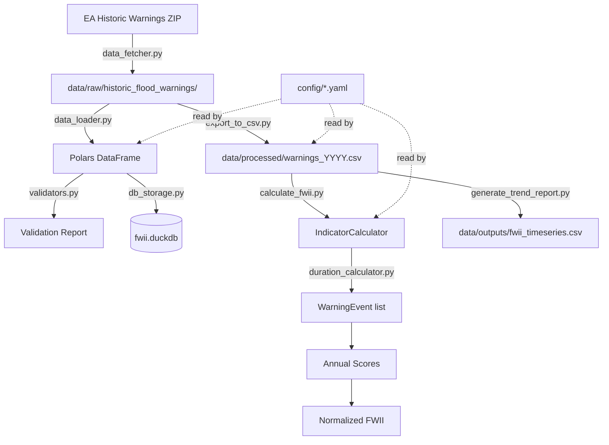

# FWII Architecture

## Overview

The Flood Warning Intensity Index (FWII) system downloads Environment Agency historic
flood warning data, filters it to 18 West of England warning areas, calculates
duration-weighted severity scores, and normalises against a 2020 baseline to produce
a composite index. It's a batch pipeline run annually via CLI scripts.

## Architecture Diagram

## Components

### Config Layer

**Purpose**: Load settings, warning area definitions, and baseline values from YAML.

**Location**: `src/fwii/config.py`, `config/settings.yaml`, `config/warning_areas.yaml`,
`config/baseline_2020.yaml`

**Key Symbols**: `Config` class with property accessors for all settings.

**Interactions**: Read by nearly every other module. `data_loader.py` reads
`warning_areas.yaml` directly (bypassing `Config`). `indicator_calculator.py` reads
`baseline_2020.yaml` directly (bypassing `Config`). Scripts also read
`warning_areas.yaml` directly with `yaml.safe_load`.

### Data Fetcher

**Purpose**: Download and extract the EA Historic Flood Warnings ZIP.

**Location**: `src/fwii/data_fetcher.py`

**Key Symbols**: `HistoricWarningsFetcher`, `DataFetchError`

**Interactions**: Called by `download_historic_data.py`. Outputs to `data/raw/`. Has a
vestigial `download_historic_warnings()` method kept for backward compatibility.

### Data Loader

**Purpose**: Parse CSV/ODS/JSON files, normalise EA column names to internal schema,
parse timestamps, filter to West of England areas.

**Location**: `src/fwii/data_loader.py`

**Key Symbols**: `HistoricWarningsLoader`, `DataLoadError`

**Interactions**: Called by `download_historic_data.py` and `export_to_csv.py`. Reads
`warning_areas.yaml` to get the fwdCode filter set.

### Duration Calculator

**Purpose**: Estimate warning durations using heuristics (EA data lacks end times),
then score by severity weight.

**Location**: `src/fwii/duration_calculator.py`

**Key Symbols**: `DurationCalculator`, `DurationConfig`, `WarningEvent`

**Interactions**: Called by `IndicatorCalculator`. Converts a Polars DataFrame into a
`list[WarningEvent]` via row-by-row Python iteration.

### Indicator Calculator

**Purpose**: Orchestrate duration calculation, annual aggregation, baseline
normalisation, and composite FWII.

**Location**: `src/fwii/indicator_calculator.py`

**Key Symbols**: `IndicatorCalculator`, `BaselineScores`, `NormalizedIndicators`

**Interactions**: Called by `calculate_fwii.py` and `generate_trend_report.py`. Reads
`baseline_2020.yaml` directly. Owns an internal `DurationCalculator`.

### DB Storage (unused - to be removed)

**Purpose**: Store warnings in DuckDB with schema, indexes, and query helpers.

**Location**: `src/fwii/db_storage.py`

**Key Symbols**: `FloodWarningsDatabase`, `DatabaseError`

**Interactions**: Called by `download_historic_data.py`. **Not used by any calculation
or reporting scripts** - they read from CSV files instead.

### Validators

**Purpose**: Check data quality (missing fields, duplicates, timestamp consistency,
completeness).

**Location**: `src/fwii/validators.py`

**Key Symbols**: `HistoricWarningsValidator`, `ValidationReport`, `ValidationIssue`

**Interactions**: Called by `download_historic_data.py`. Results saved as JSON.

### Scripts

| Script | Purpose | Reads From | Writes To |
|--------|---------|------------|-----------|
| `fetch_warning_areas.py` | Fetch area definitions from API | EA API | `config/warning_areas.yaml` |
| `download_historic_data.py` | Full download-load-validate-store pipeline | EA ZIP | DuckDB + CSVs + JSON reports |
| `export_to_csv.py` | Export ODS data to per-year CSVs | `data/raw/` ODS | `data/processed/warnings_YYYY.csv` |
| `calculate_fwii.py` | Calculate FWII for one year | `data/processed/` CSV | stdout |
| `generate_trend_report.py` | Multi-year trend analysis | `data/processed/` CSV | `data/outputs/fwii_timeseries.csv` |

## Data Flow

1. **Fetch**: `data_fetcher.py` downloads a ~3.5MB ZIP from EA, extracts ODS/CSV to
   `data/raw/historic_flood_warnings/`.
2. **Load & Filter**: `data_loader.py` reads the raw files, maps EA column names
   (`DATE`/`CODE`/`TYPE`) to internal names (`timeRaised`/`fwdCode`/`severity`),
   derives `severityLevel` from text, parses timestamps, and filters to 18 configured
   fwdCodes.
3. **Export**: `export_to_csv.py` (or the download pipeline) writes per-year CSVs to
   `data/processed/`, joining `isTidal` from config.
4. **Calculate**: `calculate_fwii.py` loads a year's CSV, joins `isTidal` again from
   config, runs `DurationCalculator` (row-by-row heuristic), aggregates scores,
   normalises against 2020 baseline.
5. **Report**: `generate_trend_report.py` repeats step 4 for all years >= 2020,
   produces a summary table and trend CSV.

## Configuration

| File | Purpose |
|------|---------|
| `config/settings.yaml` | API URLs, rate limits, severity weights, composite weights, baseline year |
| `config/warning_areas.yaml` | 18 warning areas with fwdCode, label, county, isTidal |
| `config/baseline_2020.yaml` | 2020 raw scores used for normalisation |

---

## Improvement Recommendations

### 1. DuckDB is unused dead weight

**Problem**: `db_storage.py` (140 lines) stores data into DuckDB, but no calculation
or reporting script reads from it. `calculate_fwii.py` and `generate_trend_report.py`
both read from CSV files. The DuckDB database is written but never queried by the
pipeline.

**Fix**: Remove DuckDB entirely. The CSVs are small (~1,500 rows/year) and serve as
the actual source of truth already.

### 2. isTidal is joined inconsistently in 3 places

**Problem**: The `isTidal` field comes from `warning_areas.yaml`, but is joined onto
the data separately in:
- `export_to_csv.py` (lines 31-40)
- `calculate_fwii.py` `load_warnings_with_tidal()` (lines 33-51)
- `generate_trend_report.py` assumes it's already in the CSV

Each does the join slightly differently (one defaults missing to `False`, another to
`None`). This is a guaranteed source of subtle bugs.

**Fix**: Join `isTidal` once during data loading (in `HistoricWarningsLoader`) so every
downstream consumer gets it automatically.

### 3. Row-by-row Python loop in the hot path

**Problem**: `DurationCalculator.calculate_durations()` converts the entire DataFrame
to a list of Python `WarningEvent` dataclass instances via `df.iter_rows(named=True)`.

**Fix**: Replace with pure Polars columnar expressions. Remove `WarningEvent` dataclass.

### 4. Scripts bypass the Config class

**Problem**: `calculate_fwii.py`, `export_to_csv.py`, and `generate_trend_report.py`
each directly `yaml.safe_load()` config files. `indicator_calculator.py` builds its own
path to `baseline_2020.yaml`.

**Fix**: Route all config access through `Config`.

### 5. sys.path manipulation in every script

**Problem**: Every script starts with `sys.path.insert(0, ...)`. Fragile and breaks
from unexpected working directories.

**Fix**: Install the package properly via `pyproject.toml` entry points.

### 6. No single "run everything" entry point

**Problem**: Updating the indicator requires running 3 scripts in sequence.

**Fix**: Create a single pipeline entry point.

### 7. Duplicate work across scripts

**Problem**: `export_to_csv.py` re-loads and filters the same raw data that
`download_historic_data.py` already processed.

**Fix**: Fold CSV export into the download pipeline. Delete `export_to_csv.py`.

### 8. Hardcoded paths scattered throughout

**Problem**: Relative path strings like `"data/processed/fwii.duckdb"` break if working
directory is not project root.

**Fix**: All paths resolve via `Config.project_root`.

### 9. No tests

**Problem**: `tests/` directory is empty.

**Fix**: Add tests for duration calculation, severity mapping, isTidal join, and
baseline normalisation.

### 10. Severity text mapping order is fragile

**Problem**: Regex chain in `_normalize_schema()` depends on check order.

**Fix**: Use exact string matching against the known EA vocabulary.
