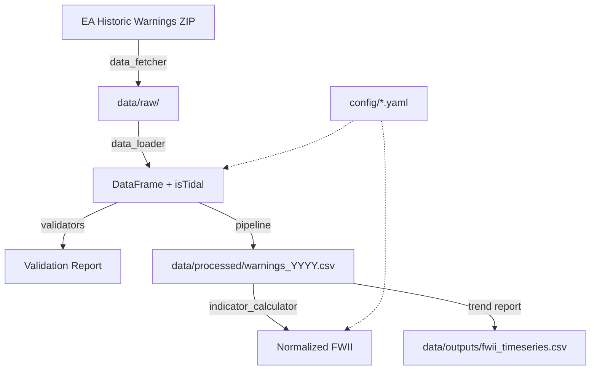

# FWII Simplification Plan

Implementation plan for the changes identified in `docs/architecture.md`.
Ordered so each step builds on the previous one and the pipeline remains
functional after each step.

---

## Phase 1: Foundation (config + packaging)

These changes underpin everything else. Do them first.

### 1.1 Fix pyproject.toml and install properly

**Files**: `pyproject.toml`, all `scripts/*.py`

- Rename project from `"vs-code-setup"` to `"fwii"`
- Add `[tool.setuptools.packages.find]` or equivalent to expose `src/fwii`
- Add `[project.scripts]` entry points for key commands (e.g., `fwii-pipeline`,
  `fwii-calculate`, `fwii-trend`)
- Run `uv pip install -e .`
- Remove `sys.path.insert(0, ...)` from all 5 scripts

**Test**: `python -c "from fwii.config import Config; print(Config())"` works from
any directory.

### 1.2 Route all config access through Config

**Files**: `src/fwii/config.py`, `src/fwii/data_loader.py`,
`src/fwii/indicator_calculator.py`, `scripts/calculate_fwii.py`,
`scripts/export_to_csv.py`, `scripts/generate_trend_report.py`

- Add `warning_areas` property to `Config` that returns the parsed list of area dicts
  (with `fwdCode`, `isTidal`, etc.)
- Add `warning_area_codes` property returning `set[str]` of fwdCodes
- Add `baseline` property that loads and returns `BaselineScores` (or `None`)
- Add `save_baseline()` method to `Config`
- Update `HistoricWarningsLoader.__init__()` to get codes from `Config` instead of
  reading YAML directly
- Update `IndicatorCalculator._load_baseline()` to use `Config.baseline_path`
  (already a property, just unused)
- Remove all direct `yaml.safe_load()` calls in scripts — use `Config` instead

**Test**: Grep for `yaml.safe_load` outside of `config.py` — should find none.

### 1.3 Resolve all hardcoded relative paths

**Files**: `src/fwii/db_storage.py` (before removal), `src/fwii/data_fetcher.py`,
`scripts/download_historic_data.py`

- Replace `Path("data/processed/...")` with `config.data_processed_path / "..."`
- Replace `Path("data/raw")` with `config.data_raw_path`
- Replace `Path("config/warning_areas.yaml")` with `config.warning_areas_path`

**Test**: Run pipeline from a different working directory — should still work.

---

## Phase 2: Remove DuckDB

### 2.1 Remove db_storage.py and DuckDB dependency

**Files to delete**: `src/fwii/db_storage.py`

**Files to edit**: `scripts/download_historic_data.py`, `pyproject.toml`

- Remove Stage 4 (Store) from `download_historic_data.py` `process_single_year()`
- Remove `from fwii.db_storage import FloodWarningsDatabase` import
- Remove `duckdb>=1.4.0` from `pyproject.toml` dependencies
- Delete `data/processed/fwii.duckdb` (mention in commit message, don't gitignore)
- Update `download_historic_data.py` to write per-year CSVs as its final output
  (absorbing the logic from `export_to_csv.py`)

**Test**: Run `download_historic_data.py 2020 2024` — produces CSV files, no DuckDB
errors.

### 2.2 Delete export_to_csv.py

**Files to delete**: `scripts/export_to_csv.py`

The download pipeline now produces the CSVs directly, making this script redundant.

**Test**: Per-year CSVs in `data/processed/` are identical to before.

---

## Phase 3: Join isTidal once

### 3.1 Move isTidal join into HistoricWarningsLoader

**Files**: `src/fwii/data_loader.py`, `scripts/calculate_fwii.py`,
`scripts/generate_trend_report.py`

- In `HistoricWarningsLoader._filter_west_of_england()`, after filtering by fwdCode,
  join `isTidal` from the warning areas config
- This means every DataFrame returned by the loader already has `isTidal`
- Remove `load_warnings_with_tidal()` from `calculate_fwii.py`
- Remove the manual isTidal join from `generate_trend_report.py`
- Remove the manual isTidal join from `download_historic_data.py` (now in Phase 2)

**Test**: Load data for any year, assert `isTidal` column exists with no nulls for
known areas.

---

## Phase 4: Fix severity mapping

### 4.1 Use exact string matching instead of regex

**Files**: `src/fwii/data_loader.py`

Replace the current regex chain:
```python
pl.when(pl.col("severity").str.contains("(?i)severe")).then(1)
  .when(pl.col("severity").str.contains("(?i)warning")).then(2)
  ...
```

With exact matching:
```python
SEVERITY_MAP = {
    "Severe Flood Warning": 1,
    "Flood Warning": 2,
    "Flood Alert": 3,
    "Warning No Longer in Force": 4,
}
```

Use `pl.col("severity").replace(SEVERITY_MAP)` or a `when/then` chain with exact
equality. Log any values that don't match as warnings.

**Test**: Pass each known EA severity string and verify correct mapping. Pass an
unknown string and verify it maps to `None` (not silently misclassified).

---

## Phase 5: Vectorise duration calculation

### 5.1 Replace row-by-row loop with Polars expressions

**Files**: `src/fwii/duration_calculator.py`

The current logic per row is:
```
if gap_to_next is None: duration = default_duration
elif gap_to_next > max_gap: duration = default_duration
elif is_update: duration = gap_to_next
else: duration = min(gap_to_next, default_duration)
```

This translates directly to Polars `when/then/otherwise`:
```python
default_dur = pl.col("severityLevel").replace(default_durations)

duration = (
    pl.when(pl.col("gap_to_next_hours").is_null())
    .then(default_dur)
    .when(pl.col("gap_to_next_hours") > max_gap)
    .then(default_dur)
    .when(pl.col("is_update"))
    .then(pl.col("gap_to_next_hours"))
    .otherwise(pl.min_horizontal("gap_to_next_hours", default_dur))
)
```

- `calculate_durations()` returns a `pl.DataFrame` instead of `list[WarningEvent]`
- `calculate_annual_scores()` accepts a `pl.DataFrame` and uses `group_by`/`sum`
- Remove `WarningEvent` dataclass (no longer needed)
- Update `IndicatorCalculator` to work with the new DataFrame return type

**Test**: Compare output of vectorised calculation against the current row-by-row
implementation for all years 2020-2024. Results must match exactly.

### 5.2 Simplify IndicatorCalculator

**Files**: `src/fwii/indicator_calculator.py`

- `calculate_indicators()` now receives a DataFrame with duration/score columns
  already attached (from the vectorised calculator)
- Aggregation becomes simple `group_by("isTidal").agg(pl.sum("score"))` calls
- Remove intermediate dict unpacking — work directly with DataFrames

---

## Phase 6: Single pipeline entry point

### 6.1 Create unified pipeline script

**Files**: New `scripts/run_pipeline.py` (or `src/fwii/__main__.py`)

```
Usage:
  fwii-pipeline 2024              # Single year
  fwii-pipeline 2020 2024         # Range
  fwii-pipeline 2020 --full       # Download + calculate + trend report
```

Steps:
1. Download (if needed)
2. Load + filter + validate
3. Export per-year CSVs
4. Calculate FWII for requested years
5. Generate trend report (if `--full` or range)

Keep `calculate_fwii.py` and `generate_trend_report.py` as standalone scripts for
ad-hoc use, but the default workflow is the unified pipeline.

**Test**: Run `fwii-pipeline 2020 2024 --full` from scratch — produces all expected
outputs.

---

## Phase 7: Tests

### 7.1 Duration calculation tests

**File**: `tests/test_duration_calculator.py`

Test cases:
- Single warning, no next warning: gets default duration
- Two warnings within max_gap: first gets `min(gap, default)`
- Two warnings beyond max_gap: first gets default duration
- Update message: gets full gap duration
- Level 4 warning: gets 0 score (weight = 0)
- Empty DataFrame: returns empty result

### 7.2 Severity mapping tests

**File**: `tests/test_data_loader.py`

Test cases:
- Each known EA string maps to correct level (1-4)
- Unknown string maps to `None`
- Case variations (if still supporting case-insensitive)

### 7.3 isTidal join tests

**File**: `tests/test_data_loader.py`

Test cases:
- Known fluvial area code gets `isTidal=False`
- Known coastal area code gets `isTidal=True`
- Unknown area code (filtered out, but if present) gets `None`

### 7.4 Indicator calculation tests

**File**: `tests/test_indicator_calculator.py`

Test cases:
- Baseline year returns indices of 100.0
- Year with double the fluvial score returns fluvial_index of 200.0
- Zero baseline score handled without division error
- Composite FWII = 0.55 * fluvial + 0.45 * coastal

### 7.5 Config tests

**File**: `tests/test_config.py`

Test cases:
- Config loads from default path
- `warning_area_codes` returns expected set
- `baseline` property returns `BaselineScores` or `None`

---

## Phase 8: Cleanup

### 8.1 Remove dead code

- Delete vestigial `download_historic_warnings()` from `data_fetcher.py`
- Remove `pandas` dependency from `pyproject.toml` if ODS loading is no longer
  needed (check whether raw data is CSV or ODS)
- Remove `ipykernel` dependency if notebooks aren't used
- Clean up unused imports across all files

### 8.2 Update architecture diagram

Update `docs/architecture.md` with the simplified flow:



---

## Execution order summary

| Phase | What | Risk |
|-------|------|------|
| 1 | Fix packaging + centralise config | Low — no logic changes |
| 2 | Remove DuckDB | Low — unused code removal |
| 3 | Join isTidal once | Low — single join location |
| 4 | Fix severity mapping | Low — swap regex for exact match |
| 5 | Vectorise duration calc | Medium — core logic rewrite, needs careful testing |
| 6 | Unified pipeline | Low — orchestration only |
| 7 | Tests | None — additive |
| 8 | Cleanup | Low — dead code removal |

Phases 1-4 are safe, low-risk simplifications. Phase 5 is the most significant
change and should be validated by comparing output against the current implementation
before replacing it.
